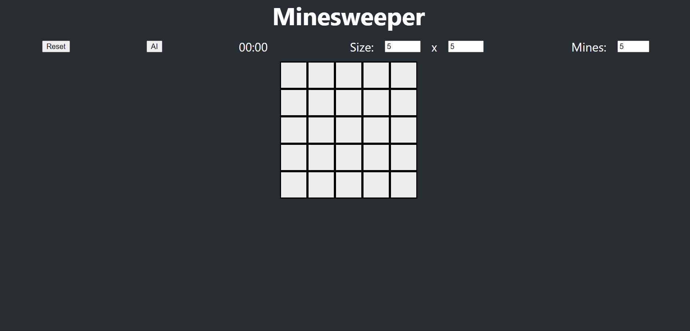

# Minesweeper



This is minesweeper implemented in React. A human can solve the puzzles themselves or an agent can attempt to solve the puzzle itself. The size of the board and the number of mines can be adjusted.

## Directions

Play online [here](https://abhiek187.github.io/minesweeper/), or run a local copy:

```
npm install
npm start
```
